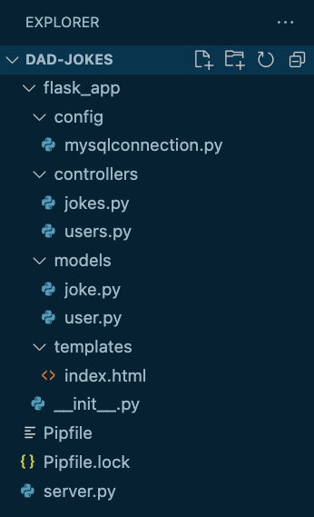

# Python Belt Exam Guidelines
I highly recommend that you prepare your exam project in advance. You should at least have a working login and registration component already tested and working.

A red belt will require implementation of a one-to-many relationship between users and some other table. This other table cannot be pre-coded, but it can be generated from a boilerplate model that prep beforehand. Use the replace all feature in VS Code and remember to preserve case.

## Project Directory Structure
Screen shot of typical directory structure:

## File preparation
